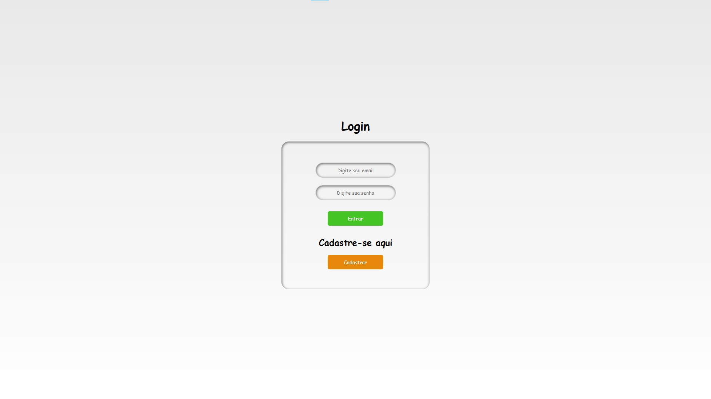
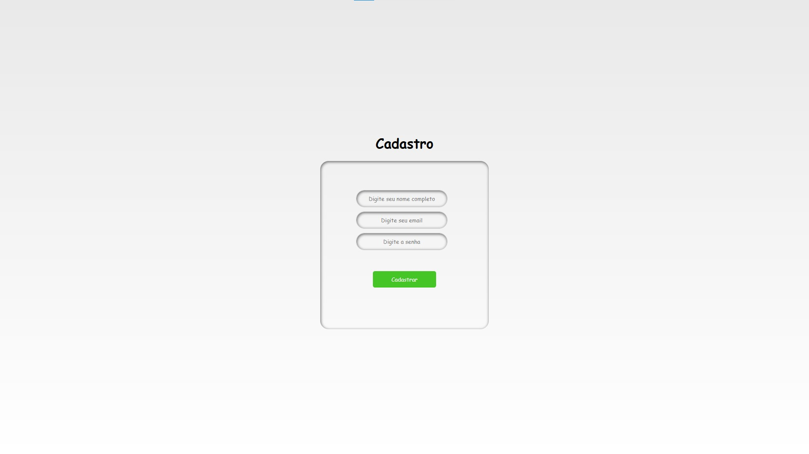
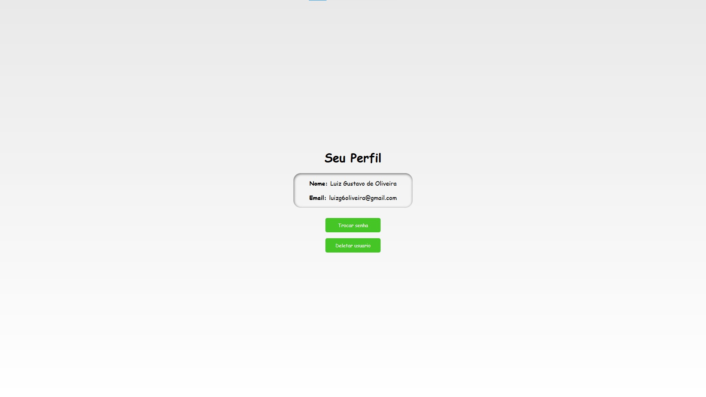
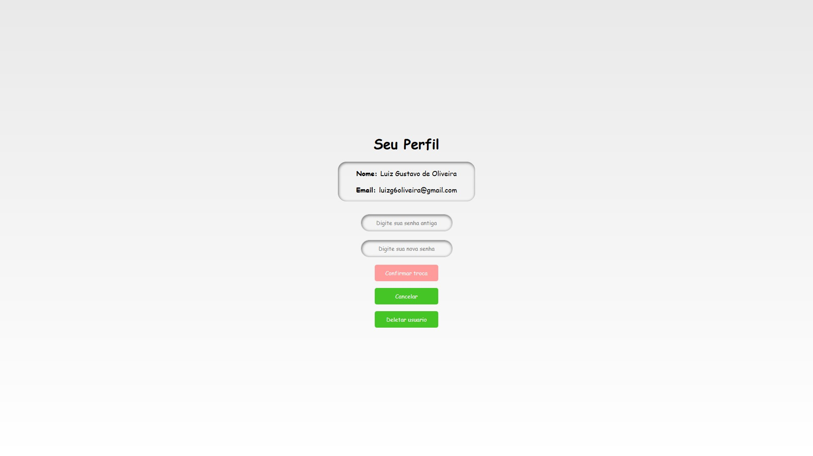
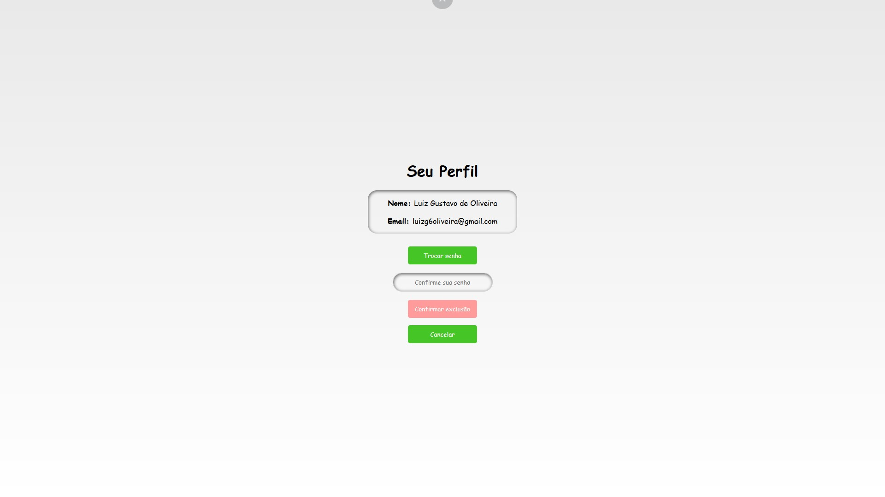

# 🔐 API de Autenticação com Node.js e MySQL

API REST desenvolvida para gerenciamento de usuários, com funcionalidades completas de cadastro, login e operações CRUD.

## 🚀 Funcionalidades

* Cadastro de usuários
* Listagem de usuários
* Busca de usuário por ID (perfil)
* Atualização de dados (senha)
* Exclusão de usuário
* Login básico com validação de credenciais

## 🛠️ Tecnologias utilizadas

* Node.js
* Express
* MySQL
* dotenv
* React.js
* JWT
* bcrypt

## 📡 Rotas da API

### 🔹 Usuários

* `POST /usuarios` → Criar usuário
* `GET /usuarios` → Listar usuários
* `GET /usuarios/:id` → Buscar usuário por ID
* `PUT /usuarios/:id` → Atualizar usuário
* `DELETE /usuarios/:id` → Deletar usuário

### 🔹 Autenticação

* `POST /login` → Login do usuário

## 📦 Exemplo de requisição

### Criar usuário

```json
{
  "nome": "Luiz",
  "email": "luiz@email.com",
  "senha": "123456"
}
```

---

### Login

```json
{
  "email": "luiz@email.com",
  "senha": "123456"
}
```

## ⚙️ Configuração do projeto

1. Clone o repositório:

```bash
git clone https://github.com/oLuiz1n/nodejs-login-api-mysql
```

2. Instale as dependências:

```bash
npm install
```

3. Crie um arquivo `.env` na raiz do projeto:

```env
DB_HOST=localhost
DB_USER=root
DB_PASSWORD=
DB_NAME=usuarios
```

4. Inicie o servidor:

```bash
node server.js
```

5. Inicie o Front:

```bash
npm run dev
```

---

## ⚠️ Observações

* Este projeto foi desenvolvido para fins de estudo
* As senhas já estão criptografadas
* Futuramente será implementado:

  * --PROJETO COMPLETADO

---

## 🎯 Objetivo

Este projeto foi criado para prática de desenvolvimento backend, integração com banco de dados e construção de APIs REST.

---

## 📷Previews

  ### 🖥️Login:

---

  ### 🖥️Cadastro:

---

  ### 🖥️Perfil:

---

  ### 🖥️Perfil + Trocar Senha:

---

  ### 🖥️Perfil + Excluir Perfil:

---